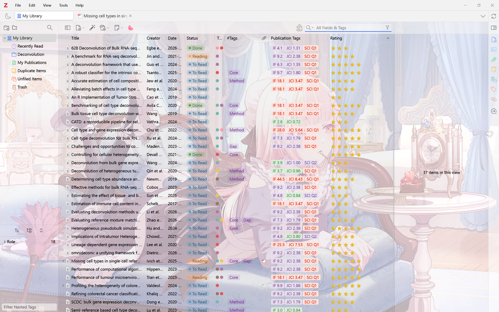
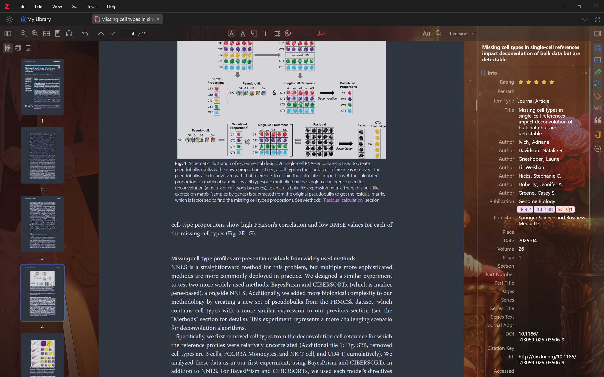

# Zotero Wallpaper

Wallpaper & UI optimization for Zotero 10.

<p align="center">
  
  
</p>

> **Note:** Screenshots are shown with [Ethereal Style](https://github.com/MuiseDestiny/zotero-style) enabled.

[中文](#中文) · [English](#english)

## English

Supports one image or a folder, random selection on startup, 5/10/15/30-minute rotation, opacity control, Cover/Contain/Center/Stretch layouts, and single-image sizing and positioning.

Download the XPI from [Releases](https://github.com/endoretic/zotero-wallpaper/releases), install it from `Tools → Plugins`, then configure it under `Edit → Settings → Zotero Wallpaper`.

### Development

Create an extension proxy named `zotero-wallpaper@endoretic.github.io` in the Zotero profile `extensions` folder and place this repository's absolute path inside it. Restart Zotero with `-purgecaches`; no development XPI is required.

```powershell
powershell -ExecutionPolicy Bypass -File .\scripts\check.ps1
```

### Release

Update `manifest.json` to a new version and push to `main`. CI creates the matching GitHub Release, XPI, and `updates.json` once per version.

Compatibility: May conflict with theme plugins.

## 中文

支持单张图片或文件夹、启动时随机选择、5/10/15/30 分钟随机切换、透明度调节、覆盖/填充/居中/拉伸布局，以及单图大小与位置调整。

从 [Releases](https://github.com/endoretic/zotero-wallpaper/releases) 下载 XPI，通过 `工具 → 插件` 安装，然后前往 `编辑 → 设置 → Zotero Wallpaper` 配置。

### 开发

在 Zotero 配置目录的 `extensions` 文件夹中创建名为 `zotero-wallpaper@endoretic.github.io` 的 extension proxy，内容为本仓库绝对路径。使用 `-purgecaches` 重启 Zotero；开发阶段无需打包 XPI。

```powershell
powershell -ExecutionPolicy Bypass -File .\scripts\check.ps1
```

### 发布

更新 `manifest.json` 中的版本号并推送至 `main`；CI 会为每个新版本自动创建 GitHub Release、XPI 和 `updates.json`。

兼容性：可能与主题类插件冲突。
